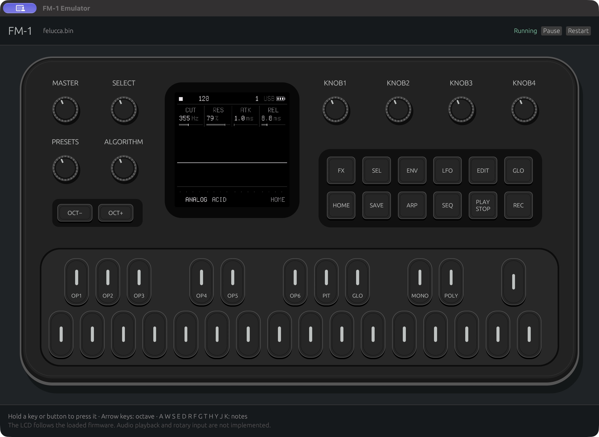

# FM-1 emulator (hdavid fork)

An emulator for the M-VAVE FM-1 (pi32v2 / JieLi AC79 firmware, written in
Rust). Load a firmware and play it from the emulated panel, with its own
screen, buttons, knobs and sound.

This branch (`feat/upstream-merge`) is **[simonjohansson/fm1-emulator](https://github.com/simonjohansson/fm1-emulator)
(upstream `main`, by Simon Johansson) plus the additions listed below**. The
same work is offered back to upstream as five pull requests, so this fork is
meant to disappear as they are reviewed:

| Upstream PR | Group |
| --- | --- |
| [#9](https://github.com/simonjohansson/fm1-emulator/pull/9) | UI: knobs, MASTER, host audio, LEDs, themes, computer keys, remembered settings |
| [#10](https://github.com/simonjohansson/fm1-emulator/pull/10) | CPU: compiler forms, divide trap, float compare-branches, cycle counters |
| [#11](https://github.com/simonjohansson/fm1-emulator/pull/11) | Devices: USB-MIDI host and web editor bridge, UART MIDI IN, USB audio host, nested IRQs |
| [#12](https://github.com/simonjohansson/fm1-emulator/pull/12) | Speed: event-scheduled devices, idle skip, leaner interpreter, profiler |
| [#13](https://github.com/simonjohansson/fm1-emulator/pull/13) | Tools and persistence: op-scan, flash kept between runs, diagnostics |

Contents: [What this fork adds](#what-this-fork-adds) |
[Quick start](#quick-start) | [Keys](#keys) | [TODO](#todo) |
[Upstream's README](#upstream-readme-simon-johansson)

Everything below the "Upstream's README" heading is upstream's text, kept as
it was (apart from its old to-do list, which the TODO above replaces). The
[emulator README](rust-emulator/README.md) has the full usage and design notes.

## What this fork adds

Each line was checked against the code and `git log upstream/main..feat/upstream-merge`.

### CPU correctness

- The compiler forms Felucca, Jangada, SLOOP and Optimist builds use: signed offsets
  and increment forms of memory accesses, byte/halfword/word loads and stores
  with register post-increment, rotates, 64-bit pair shifts and
  multiply-accumulate, masked push/pop. Found with `op-scan` (see Tools).
- Signed wide division, conversions (float-to-integer saturates), special-register
  frames.
- The divide-by-zero trap, raised as the CPU exception when `EMU_CON` arms it.
- Float compare-branches (register and immediate forms, six-byte compare-branches) and float conditional blocks.
- SIMD packed 16-bit forms.
- The corex2 cycle counters (`TL_CKCNT`) and their `DBG_CON` enables.
- Optional nested interrupts (`nested_irqs`, off by default; `FM1_NESTED_IRQ=1`).
- An interrupt can enter after a conditional arm returns (the conditional-exit IRQ fix).

### Devices and I/O

- A USB-MIDI host and a loopback bridge to a firmware's own web editor,
  served at `http://127.0.0.1:8765/` ([how it works](rust-emulator/README.md#web-editor-usb-midi-over-a-local-websocket)).
- TRS MIDI IN on UART1.
- A USB audio (UAC1) host.
- USB endpoint 4 with its own count and DMA registers (Felucca 1.0 and later).
- A stock `USR` copied from another package is installed where its CRC verifies.

### Speed

- Event-scheduled device time and idle skip (a halted core jumps to the next device event).
- A leaner interpreter loop: boxed faults off the hot path, interrupt check
  skipped while nothing is pending, inlined guest memory accesses, a short
  call chain, branch-free merging of parallel-bundle slots.
- Spin-loop skip (a core busy-waiting on a device is jumped over).
- The GUI worker thread runs at the main thread's scheduling class.
- The FM1_HOT profiler.
- Numbers and method: [PERFORMANCE.md](rust-emulator/PERFORMANCE.md).

### Panel UI (`fm1-ui`)

- Rotary encoders (drag, scroll, keys) and the MASTER potentiometer.
- Host audio output; the guest's audio queue paces the CPU.
- LEDs on the drawn panel, measured from the matrix pins.
- The FM-1's colour editions as panel themes: Classic, Black, Lilac, Orange,
  Mint, Cream, Blue.
- A computer key for every panel button, note-key tooltips; Space plays and stops.
- Remembered window settings (`fm1-ui.toml`: MASTER, theme, LEDs, window size).
- 192 and 312 MHz clock choices; `--cpu-mhz N` or `--cpu-mhz=N`.

### Persistence

- The firmware's flash is kept between runs, like a power cycle:
  `state/<family>.nor`, `--fresh`, `--state PATH`, and the "Reset flash
  state..." menu ([details](rust-emulator/README.md#flash-kept-between-runs)).

### Tools (all headless, `rust-emulator/examples/`)

- `play_check`: scripted panel sessions (`hold`, `release`, `release:ID,ID`,
  `turn`, `click`, `run`, `png`, `wav`, `peek`, `leds`, `master`, ...); see
  [Scripted playback](rust-emulator/README.md#scripted-playback-and-profiling).
- `bench`: throughput and determinism (`gui`, `batch`, `hash` modes, `FM1_SCENARIO`).
- `op-scan`: finds instructions the decoder does not cover, driven by the vendor objdump.
- `diagnose`, `latency` (input-to-audio and MIDI clock timing), `knob_check`,
  `preset_sweep`, `extract`.

## Quick start

Needs [mise](https://mise.jdx.dev/installing-mise.html) and a native toolchain
(see "Build from source" in upstream's README below). Firmware is not
included; `.fwsc`, `.elf` and `.bin` load.

```sh
git clone -b feat/upstream-merge https://github.com/hdavid/fm1-emulator.git
cd fm1-emulator
./emulator /path/to/firmware.fwsc
```

`./emulator` builds `fm1-ui` and opens it; it takes only `--cpu-mhz N` and
`--ui DIR`. For the other options run the binary it builds:

```sh
rust-emulator/target/release/fm1-ui --theme mint --cpu-mhz 96 /path/to/firmware.fwsc
rust-emulator/target/release/fm1-ui --state ~/fm1-state/ /path/to/firmware.fwsc
rust-emulator/target/release/fm1-ui --fresh /path/to/firmware.fwsc
```

(On macOS `./emulator` runs the same binary inside an app bundle under
`rust-emulator/target/release/`.) Options: `--cpu-mhz N` (instruction clock;
default is the firmware's own), `--ui DIR` (a firmware's web editor),
`--theme NAME`, `--state PATH`, `--fresh`.

**Flash state.** Whatever the firmware writes to its flash (projects, presets,
settings) is saved under `rust-emulator/state/<firmware family>.nor` and laid
back over the package at the next start. `--fresh` or the Flash menu's
"Reset flash state..." starts clean.

### Keys

| Panel button | Key | Panel button | Key | Panel button | Key |
|---|---|---|---|---|---|
| OCT- | Left | FX | `X` | HOME | `U` |
| OCT+ | Right | SEL | `B` | SAVE | `Z` |
| PLAY / STOP | Space | ENV | `V` | ARP | `P` |
| REC | `C` | LFO | `L` | SEQ | `Q` |
| | | EDIT | `I` | GLO | `O` |

The first thirteen notes are `A W S E D R F G T H Y J K` (a piano row). Knobs
turn by dragging, scrolling or keys (`[ ]`, `9 0`, `- =`, `1`-`8`); MASTER by
drag, scroll or `N M`. Hover a button or key for its tooltip.

## TODO

Built from the current state of this branch. Sources: S1 =
[PERFORMANCE.md](rust-emulator/PERFORMANCE.md), S2 = the other notes in
[rust-emulator/](rust-emulator/) (FELUCCA, STOCK-FIRMWARE, BAUD-GIRL, SMP,
CLOCK, ATOMIC), S3 = the maintainer's upstream-PR notes, S4 = the "not
implemented" faults in `rust-emulator/src`.

Done on this branch (were open in upstream's list):

- [x] Flash persistence between runs (`state/`, `--fresh`).
- [x] USB MIDI: host, web editor bridge, TRS MIDI IN (S2: README).
- [x] Host audio output and rotary controls.
- [x] Nested interrupts (optional, off by default; unmeasured on hardware).

Open:

- [ ] **Real time on a busy song.** Measured by the maintainer on an Apple-silicon
  Mac, a busy song at 0.6-0.98x real time at host load about 6, so the
  sound can still break up (S1, S3). Light firmware at 24-96 MHz is faster:
  see the tables in PERFORMANCE.md.
- [ ] **Block cache and JIT are experimental and off by default**
  (`FM1_BLOCK_CACHE=1` in `bench`): each native entry still runs one guest
  instruction, and measured throughput is the same or lower. Next step is batching
  native instructions between device ticks (S1).
- [ ] **The GUI audio path is not profiled** (cpal queue, 70 ms pacing,
  texture uploads); `bench ... gui` measures the worker loop only (S1, S4).
- [ ] **Dual-core firmware.** The stock secondary-core handoff works (S2: SMP.md);
  a SLOOP dual-core prototype exists only on the separate `feat/dual-core-emu`
  branch, emulator-only and untested on hardware.
- [ ] **Instructions and peripherals still faulting** (S4): exceptional float
  operands (NaN and infinity; upstream's measured policy is to fault), high-speed
  USB, the Bluetooth/RF scheduling, UART data-register reads (MIDI input uses the RX latch), hardware
  sample-rate conversion in the audio block, SFC dynamic key changes, LCD dual data lane.
- [ ] **Firmware coverage** is partial for every firmware in the table below
  (S2: FELUCCA.md, STOCK-FIRMWARE.md, BAUD-GIRL.md). `scripts/op-scan.sh`
  reports forms the decoder lacks.
- [ ] **Hardware validation.** Only upstream's probe forms have physical comparison
  evidence; this fork's additions were checked against the vendor objdump and
  the firmwares' behaviour, not against captures from a device (S2, S3).
- [ ] **Timing.** Instructions run one per system-clock cycle; pipeline and bus
  timing, SPI/LCD timing and DAC analog behaviour are not modelled (S2: CLOCK.md, lcd.rs).
- [ ] **Encryption**: encrypted XIP below the application area and dynamic SFC key
  changes (S4).
- [ ] **Upstream PRs [#9-#13](https://github.com/simonjohansson/fm1-emulator/pulls)
  are pending review**; they depend on each other (devices on UI, speed on devices
  and CPU, tools on speed) and overlap some of upstream's own open work (S3).
- [ ] Not ported from the maintainer's fork: the per-PC decode cache (upstream's
  decode tables are used instead; about 3.7 % of samples in the last profile, S3).

---

# Upstream README (Simon Johansson)

The rest of this file is upstream's README, with only its old to-do list removed.

A Rust emulator for the M-VAVE FM-1. Load firmware and interact with its own
screen and buttons. The firmware's USB serial console uses your terminal; type
commands such as Felucca's `help` and press Enter.

## Download and run

Download and extract the [release](https://github.com/simonjohansson/fm1-emulator/releases)
for your OS and architecture (upstream's build, without this fork's additions),
then run it with a firmware path:

```sh
./emulator /path/to/firmware.fwsc
```

Use `emulator.exe` on Windows. Firmware is supplied separately; `.fwsc`, `.elf`
and `.bin` are supported.

## Build from source

Install [mise](https://mise.jdx.dev/installing-mise.html) and a native C/C++
toolchain: Xcode Command Line Tools on macOS, Visual Studio Build Tools with
**Desktop development with C++** on Windows, or the following on Ubuntu:

```sh
sudo apt-get install build-essential pkg-config libx11-dev libxi-dev libgl1-mesa-dev libxkbcommon-dev libwayland-dev
```

From this checkout:

```sh
mise trust
mise install rust
mise exec -- cargo build --manifest-path rust-emulator/Cargo.toml --locked --release --features gui --bin fm1-ui
mise exec -- cargo test --manifest-path rust-emulator/Cargo.toml --locked --release --features gui
```

On Linux/macOS, run `./emulator /path/to/firmware.fwsc`; the launcher builds and
opens the emulator. On Windows, run
`.\rust-emulator\target\release\fm1-ui.exe C:\path\to\firmware.fwsc`.
Building the emulator does not require the vendor firmware compiler or Docker.

## Firmware compatibility

Updated on 2026-10-05. **Partial** means boot and some controls work, but
other firmware paths can stop emulation. (The table is upstream's, as of that
date; it was not re-measured for this fork.)

| Firmware | Status | Verified behavior / blocker |
| --- | --- | --- |
| Felucca 0.9-beta (`FM-1_909`, `.fwsc`) | Partial | LCD, USB console (`help`), watchdog, note audio/DMA and FX pass; full UI coverage remains incomplete |
| Felucca source build (`1e838e1`, `.elf`) | Partial | Boot, note press/release, FX, HOME and ENV pass; other UI paths need broader coverage |
| Official `FM-1_015` (`FM-1.fwsc`) | Partial | LCD boot, PIANO 1, FX/HOME and note audio/DMA pass |
| Baud Girl `FM-1_093` (`FM-1_093.fwsc`) | Partial | LCD boot and FX/HOME pass; its factory preset payload fails integrity validation |

FX now opens and renders in both Felucca builds; see the
[Felucca investigation](rust-emulator/FELUCCA.md).
See the [stock firmware trials](rust-emulator/STOCK-FIRMWARE.md) for the official
and Baud Girl results.

GPL-3.0-only; see [LICENSE](LICENSE). Based on research and components from
[Felucca](https://github.com/hugelton/Felucca), the
[JieLi AC79 SDK](https://gitee.com/Jieli-Tech/fw-AC79_AIoT_SDK), and
[Quarkslab's pi32v2 reference](https://github.com/quarkslab/ghidra-jieli).
